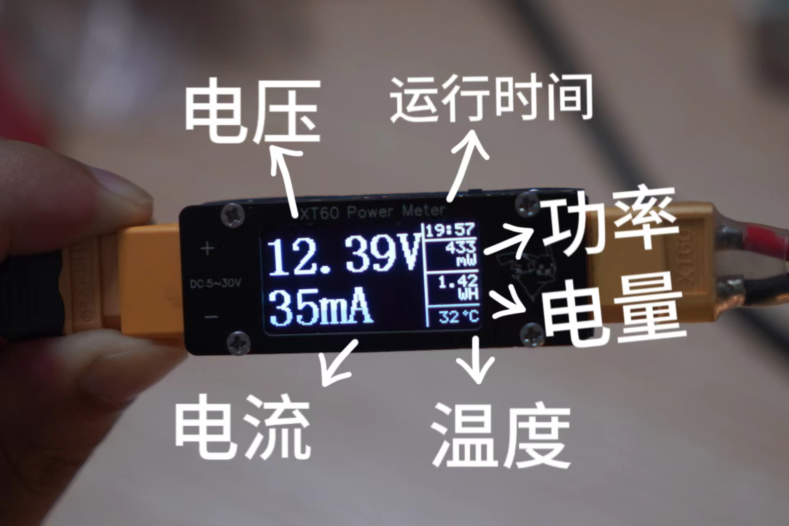
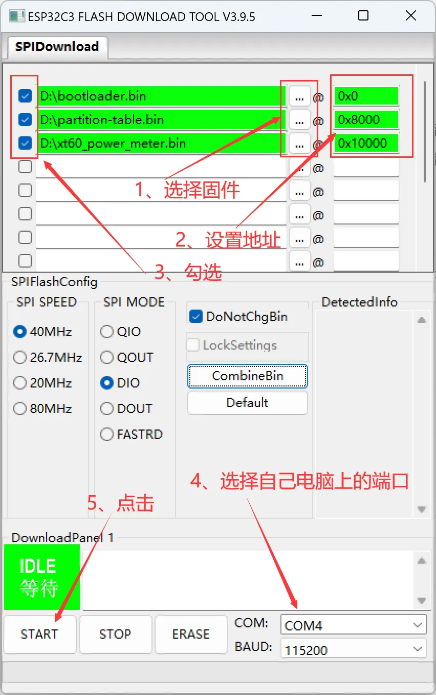

# XT60电流表航模功率计/ESP功率计

嘉立创开源地址：https://oshwhub.com/qwiaoei/xt60-powermeter

软件开源地址：https://github.com/xweicc/esp_power_mater

# 简介：

超迷你的XT60航模功率计电流表，最大64A电流 使用ESP32C3主控，INA226电流采样芯片，软硬件全开源

实物图片：

# 功能：

- 1、电流曲线，可统计最近26秒、2分钟、4分钟、26分钟、52分钟电流
- 2、最大最小电流记录
- 3、可设置低压报警、过流报警、过热报警
- 4、量程设置，32A、64A
- 5、按键报警音量设置
- 6、支持电压电流校准

### 编译说明

- 系统环境：Ubuntu 22.04
- 安装esp-idf：https://docs.espressif.com/projects/esp-idf/zh_CN/release-v5.1/esp32c3/get-started/linux-macos-setup.html
- 选择配置
    - XT60：`cp sdkconfig.esp32c3 sdkconfig`
    - XT30：`cp sdkconfig.esp32c2 sdkconfig`
- 执行`idf.py build`编译
- 执行`idf.py flash`烧录
### 功能说明
- 实时显示电压、电流、功率，可统计最近26秒、2分钟、4分钟、26分钟、52分钟电流
- 显示电流/功率历史曲线
- 累计电量统计，单位 mWh
- 过流、欠压报警
- 低压保护 / 过流保护
- 蜂鸣器提示功能
- 电压、电流、零点校准
- 保存设置和校准数据到 NVS
- 支持 OLED 或 1.47 寸 LCD 显示（可选）
- 支持 INA226 / INA238 电流传感器
- 支持 ESP32C3 内置温度传感器读取芯片温度
- 可选 ESC 模式支持

### 硬件说明
- 使用 ESP32C3 主控
- 使用 INA226 或 INA238 采样芯片
- DCDC + LDO 供电，带反接保护
- XT60 接口
- 1.29寸 OLED 或 1.47寸 LCD 屏幕
- 超迷你尺寸，7.4*2.2*1.5CM
- 输入电压：5~30V（80V 模式可选）
- 电流范围：1mA~60A，持续最大30A
- 采样电阻：2毫欧，1%精度，5W功率
### 制作说明
- 所有PCB BOM元件都可以在立创商城买到
- 打板的板厚要1.2mm
- 除PCB BOM外，还需要以下元件：
  - 1.29寸OLED显示屏，横屏，CH1115驱动，插接款
  - M2*9双通滚花铜柱*
  - M2*5沉头螺丝
- PCB为一整块，需要切割
- 焊接好后使用串口线下载程序，方法如下：
      下载固件 
      按住右下键上电
      打开flash_download_tool
- 

